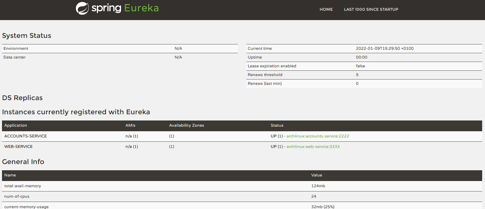
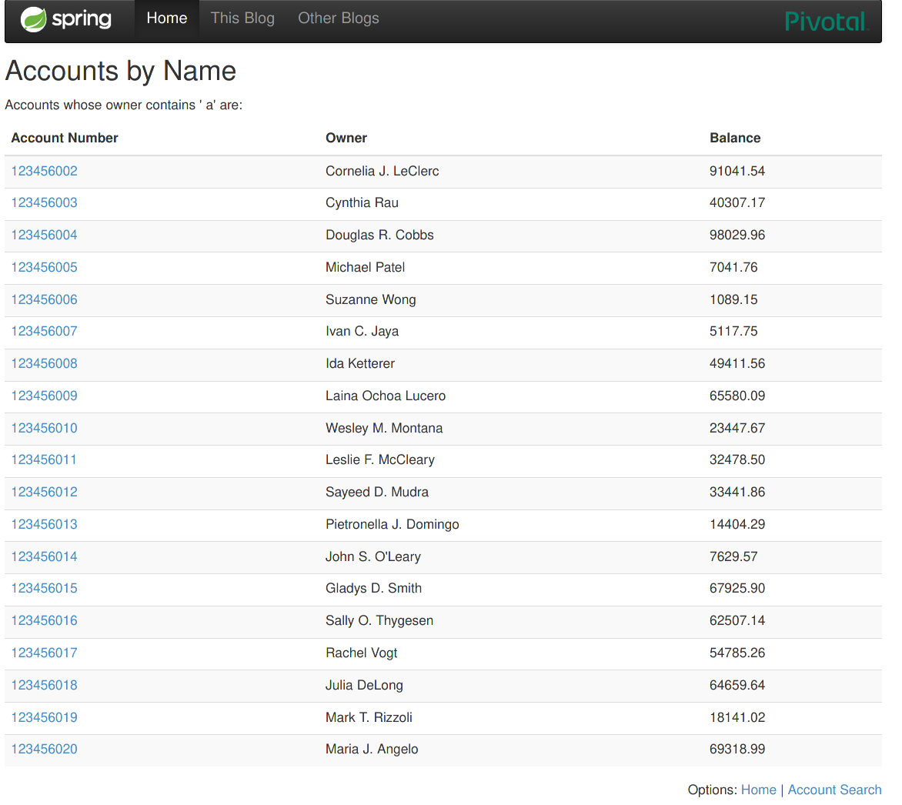
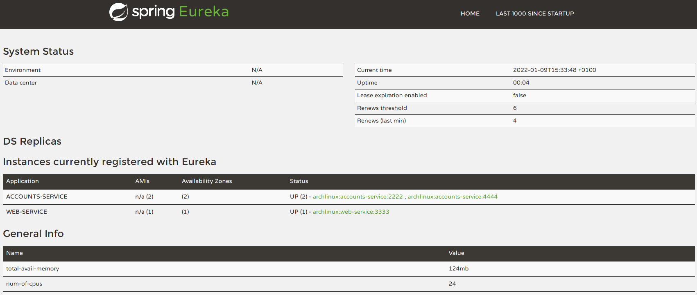
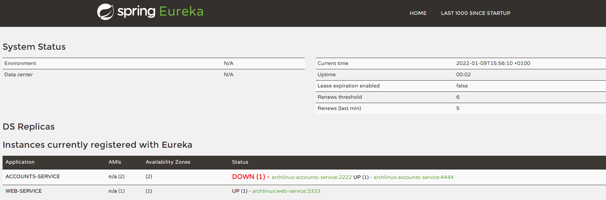
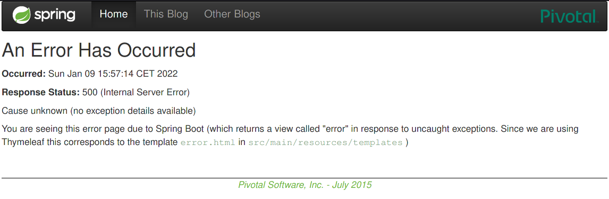

# Microservices with Spring

In this report the Eureka service auto-discovery server is going to be demonstrated.
Eureka allows the different services that make up a complete application to register themselves in a list, so that other services can send requests to obtain information, or order them to execute some task; more or less in the same way that the internal DNS of a Kubernetes cluster works, when a Service is created.

## Initial run of the services.

To start the services, start by launching the Eureka server, which belongs to the "registration" service.

To launch it the following command is executed:
```console
gradle :registration:bootRun
```


The website is then launched and automatically registered on the Eureka server.

```console
gradle :web:bootRun
```


Then, the "accounts" service is launched listening to the port 2222.

```console
gradle :accounts:bootRun
```


All three services are running and can be seen registered in the Eureka interface:


The service is running correctly, and can be seen in execution:



## Another "accounts" instance run

To run a new service "accounts" on port 4444, the application.yml file of the service is modified as follows:
```diff
diff --git a/accounts/src/main/resources/application.yml b/accounts/src/main/resources/application.yml
index c2f815a..283e1ed 100755
--- a/accounts/src/main/resources/application.yml
+++ b/accounts/src/main/resources/application.yml
@@ -4,7 +4,7 @@ spring:
 
 # HTTP Server
 server:
-  port: 2222   # HTTP (Tomcat) port
+  port: 4444   # HTTP (Tomcat) port
 
 # Discovery Server Access
 eureka:
```

It is run again by executing: 

```console
gradle :accounts:bootRun
```


It can be seen registered in Eureka, as another endpoint for the same service:



## Killing the service

After killing the service (with CTRL-C), the Eureka server identifies that the instance is down:



The web server is unable to handle the request because it's trying to access an endpoint that doesn't exist anymore, but is still provided by Eureka.
It takes some time for Eureka to detect that the instance does not exist anymore, so the web page shows some errors:



After some time Eureka understands that this service is not coming back, and removes it from its state, and the web application doesn't throw any other error, because
the "web" service is not trying to access the service at 2222.
